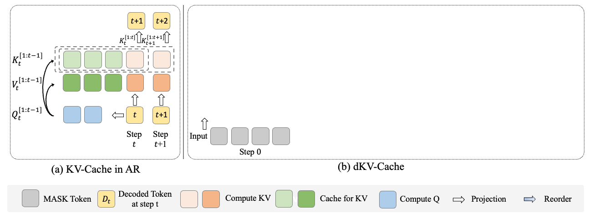
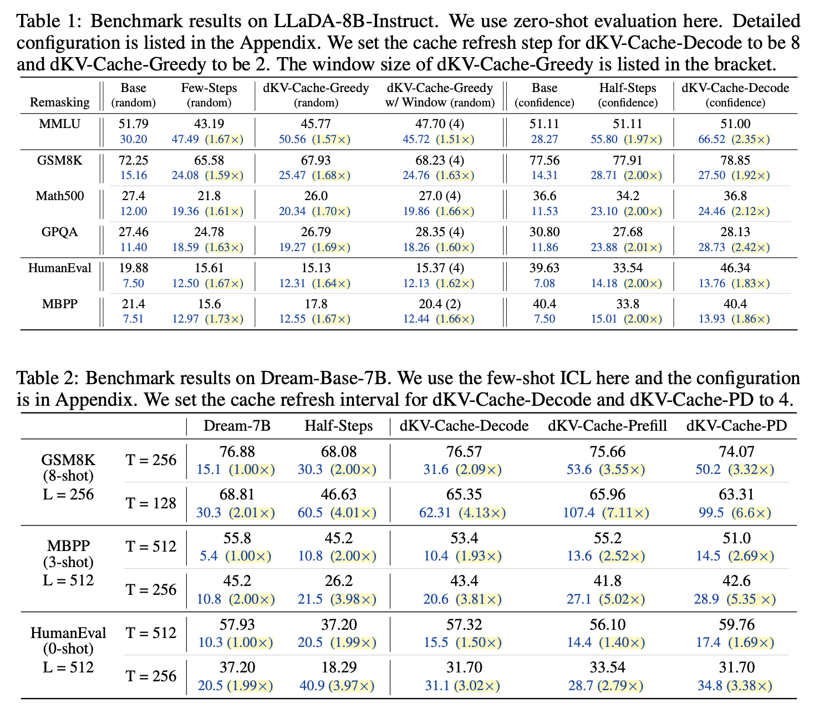

# dKV-Cache: The Cache for Diffusion Language Models
<div align="center">
  </img>
  <br>
  <em>
      The pipeline of dKV-Cache
  </em>
</div>
<br>

> **dKV-Cache: The Cache for Diffusion Language Models**   🥯[[Arxiv]]()    
> [Xinyin Ma](https://horseee.github.io/), [Runpeng Yu](https://yu-rp.github.io/), [Gongfan Fang](https://fangggf.github.io/), [Xinchao Wang](https://sites.google.com/site/sitexinchaowang/)   
> [xML Lab](https://sites.google.com/view/xml-nus), National University of Singapore

### Introduction
We propose dKV-Cache, a special KV-Cache for Diffusion Language Models.

* dKV-Cache based on the core idea that we need to delay the cache of key and values, compared to ARs.
* We have different variants for dKV-Cache: dKV-Cache-Decode for high-performance, and dKV-Cache-Greedy for potential faster speed but with performance degradation.
* dKV-Cache accelerate LLaDA and Dream. Based on the prefill length and the decoding length, the acceleration would range from 2$\times$ to 10$\times$ compared to the original implementation.

### Usage
Please install `transformers==4.46.3` first. 

* For generation on Dream:

```

import torch
- from transformers import AutoModel, AutoTokenizer
+ from models.modeling_dream import DreamModel
+ from transformers import AutoTokenizer

model_path = "Dream-org/Dream-v0-Instruct-7B"
model = DreamModel.from_pretrained(model_path, torch_dtype=torch.bfloat16, trust_remote_code=True)
tokenizer = AutoTokenizer.from_pretrained(model_path, trust_remote_code=True)
model = model.to("cuda").eval()

messages = [
    {"role": "user", "content": "Please write a Python class that implements a PyTorch trainer capable of training a model on a toy dataset."}
]
inputs = tokenizer.apply_chat_template(
    messages, return_tensors="pt", return_dict=True, add_generation_prompt=True
)
input_ids = inputs.input_ids.to(device="cuda")
attention_mask = inputs.attention_mask.to(device="cuda")

output = model.diffusion_generate(
    input_ids,
    attention_mask=attention_mask,
    max_new_tokens=512,
    output_history=True,
    return_dict_in_generate=True,
    steps=512,
    temperature=0.2,
    top_p=0.95,
    alg="entropy",
    alg_temp=0.,
+    use_cache=True,
+    cache_type="decoded",
+    cache_steps=16,
+    shift_type="un"
)
generations = [
    tokenizer.decode(g[len(p) :].tolist())
    for p, g in zip(input_ids, output.sequences)
]

print(generations[0].split(tokenizer.eos_token)[0])

```

Since we find that with `batch_size=1`, the inference acceleration is not obvious, we also provide a script for inference with large batch size:
```
CUDA_VISIBLE_DEVICES=0 python dream_generate.py --decode --cache-steps 4
```

* For generation on LLaDA:


### Result
We test our methods on LLaDA-8B-Instruct and Dream-Base-7B on the benchmark. Here are the results for the algorithm.



